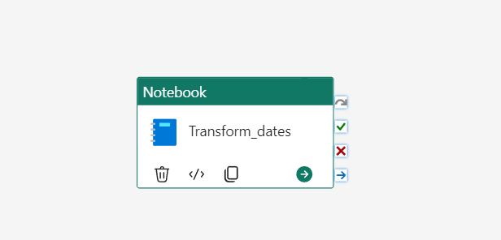
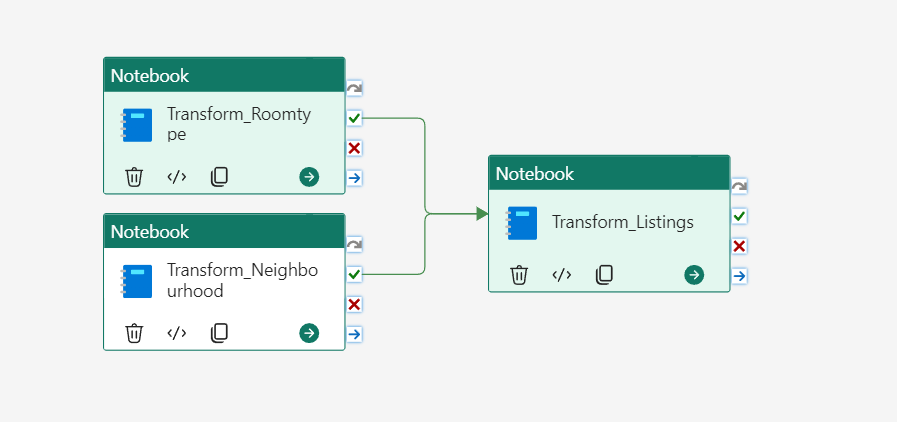
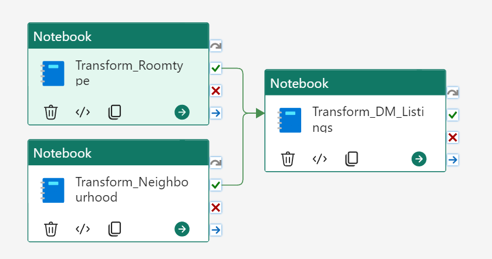
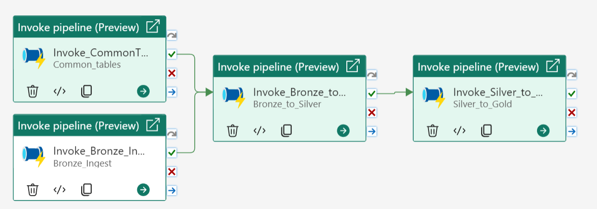

# Build a Microsoft Fabric Proof of Concept in a Day

https://sqlbits.com/attend/the-agenda/full-day-training/Ready_for_take-off_Build_a_Microsoft_Fabric_Proof_of_Concept_in_a_Day

## Welcome!

This page contains all files you will need in order to set up the data transformation of the AirBnB data we will use for this PoC. 
In addition to the notebook-files containing the data transformation, I have also added some screen shots of how I have created the different pipelines to run the notebooks and essentially the transformation of data between the different layers. 

## Notebook files: 

## Pipelin configuration: 

# Pipeline for transforming data for Common tables:

### Pipeline for transforming data from Bronze to Silver:

### Pipeline for transforming data from Silver to Gold:

# Pipeline for Orchestrating the data ingestion and transformation through all layers: 

